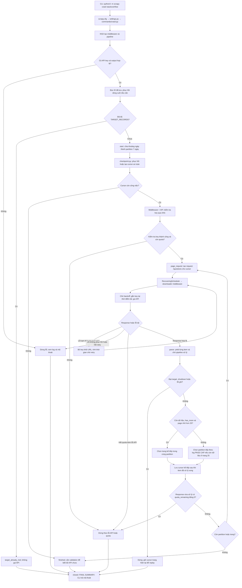
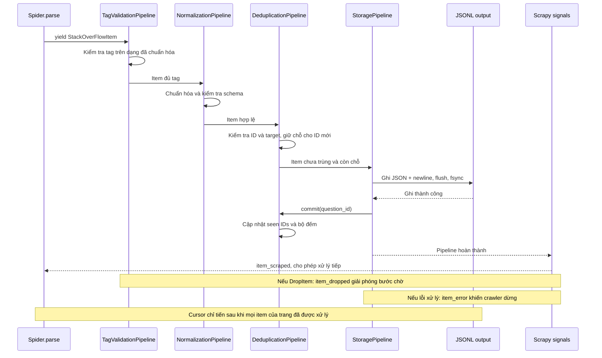
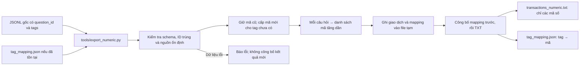

# Hướng dẫn kiến trúc và vận hành repository

Tài liệu được đối chiếu với mã nguồn ngày **28/09/2026**.

Repository thu thập câu hỏi từ Stack Exchange API bằng Scrapy, lọc và lưu các câu hỏi hợp lệ vào JSONL, sau đó có thể xuất thành giao dịch số trong TXT để phân tích các tag thường xuất hiện cùng nhau.

Một **giao dịch** tương ứng với một câu hỏi. Các **phần tử của giao dịch** là tag của câu hỏi đó. Một giao dịch hợp lệ phải có ít nhất hai tag khác nhau sau chuẩn hóa.

## 1. Hai loại dữ liệu trong hệ thống

| Loại | Nội dung | Mục đích |
|---|---|---|
| JSONL gốc | Một đối tượng JSON mỗi dòng, có `question_id`, tag và các trường ngữ cảnh | Nguồn dữ liệu chính; phục vụ kiểm tra, chống trùng và chạy tiếp |
| TXT số | Một danh sách mã tag trên mỗi dòng, không có `question_id` hay các trường ngữ cảnh | Đầu vào cho phân tích giao dịch số |
| Mapping JSON | Từ điển `tên tag → mã số` | Giải thích mã và giữ mã ổn định giữa các lần xuất |

Ví dụ minh họa dữ liệu gốc:

```json
{"question_id": 123, "tags": ["python", "scrapy"], "title": "Example", "creation_date": "2023-01-01T00:00:00Z", "score": 0, "answer_count": 0}
```

Nếu mapping là:

```json
{"python": 1, "scrapy": 2, "java": 3}
```

thì giao dịch trên được xuất thành:

```text
1 2
```

Các mã trong ví dụ chỉ để minh họa. Khi tạo mapping mới, chương trình cấp mã theo thứ tự gặp tag trong file đầu vào, bắt đầu từ 1. Hai câu hỏi khác nhau có cùng bộ tag vẫn tạo ra hai dòng TXT giống nhau, vì số lần xuất hiện có ý nghĩa trong phân tích tần suất.

## 2. Nhiệm vụ của từng file

### 2.1. Cấu hình ở thư mục gốc

| File | Nhiệm vụ |
|---|---|
| [scrapy.cfg](scrapy.cfg) | Khai báo đây là một Scrapy project và trỏ cấu hình mặc định đến `StackOverFlow.settings`. Lệnh crawl được chạy tại thư mục chứa file này. |
| [requirements.txt](requirements.txt) | Cố định phiên bản thư viện: Scrapy 2.19.0 và itemadapter 0.13.1. Môi trường cần Python 3.10 trở lên. |
| [.gitignore](.gitignore) | Loại dữ liệu xuất, checkpoint, môi trường ảo, cache Python và file môi trường khỏi Git theo các mẫu đã khai báo. |
| [REPO_GUIDE.md](REPO_GUIDE.md) | Tài liệu tổng hợp kiến trúc, cách vận hành và sơ đồ luồng của repo. |

### 2.2. Mã nguồn crawler — `StackOverFlow/`

| File | Nhiệm vụ và thành phần chính |
|---|---|
| [settings.py](StackOverFlow/settings.py) | Cấu hình spider, bốn pipeline, middleware, scheduler, tên lệnh crawl tùy chỉnh, đường dẫn output/JOBDIR, phạm vi ngày, target và retry. Mặc định một request đồng thời, độ trễ tải 1 giây; backoff có thể kéo dài thời gian chờ. |
| [items.py](StackOverFlow/items.py) | Định nghĩa dataclass `StackOverFlowItem`: `question_id`, `tags`, `title`, `creation_date`, `score`, `answer_count`. Đây là đối tượng truyền dữ liệu, không thực hiện HTTP hay lưu file. |
| [spiders/stackoverflow_spider.py](StackOverFlow/spiders/stackoverflow_spider.py) | Điều phối crawl: chia ngày thành các đoạn 7 ngày, khởi động bằng `async start()`, kiểm tra key qua `/info`, tạo request `/questions`, đọc response, yield item, chờ item xử lý xong và quyết định trang/tuần tiếp theo. Xử lý kết thúc do target, quota, lỗi hoặc hết phạm vi; ghi log tổng kết. |
| [middlewares.py](StackOverFlow/middlewares.py) | Đọc API key từ môi trường, báo lỗi khi thiếu key; kiểm tra đích HTTPS; gắn key ngay trước khi tải, gỡ key khỏi URL trước khi xử lý tiếp; che key trong log. Quản lý retry, thời gian backoff và bỏ request cũ từ phiên trước bằng `run_id`. |
| [pipelines.py](StackOverFlow/pipelines.py) | Chứa bốn pipeline kiểm tra tag, chuẩn hóa, chống trùng và ghi JSONL. `_load_seen_ids()` đọc lại output khi khởi động để xác định các ID đã lưu và kiểm tra tính toàn vẹn. Chi tiết ở phần 3. |
| [validation.py](StackOverFlow/validation.py) | Quy tắc dữ liệu dùng chung. `normalized_tags()` chuẩn hóa tag; `validate_record()` kiểm tra đối tượng đầu ra: ID nguyên dương, tag chuẩn hóa và khác nhau, timestamp UTC, kiểu của các trường còn lại. Được dùng bởi pipeline, validator và exporter. |
| [checkpoint.py](StackOverFlow/checkpoint.py) | `PageCheckpoint` đọc/ghi `JOBDIR/collector.json`. Lưu vị trí partition/trang, cấu hình, nhận diện/kích thước file output và thời hạn backoff. Ghi file tạm rồi thay thế checkpoint; nếu thông tin không đáng tin thì quay về partition đầu để lấy lại an toàn. |
| [scheduler.py](StackOverFlow/scheduler.py) | `RecoveringScheduler` mở rộng scheduler của Scrapy. Với các lỗi hỏng hàng đợi được xử lý trong code, giữ nguyên file hàng đợi và chuyển sang hàng đợi RAM; tiến độ vẫn được phục hồi từ cursor của collector. |
| [commands/crawl.py](StackOverFlow/commands/crawl.py) | Mở rộng lệnh `scrapy crawl` để trả mã thoát phù hợp với kết quả thực tế: thành công/kết thúc bình thường, lỗi hoặc hết quota. Script chạy các giai đoạn dùng mã này để quyết định có tiếp tục không. |
| [__init__.py](StackOverFlow/__init__.py) | Đánh dấu package chính của ứng dụng. |
| [spiders/__init__.py](StackOverFlow/spiders/__init__.py) | Đánh dấu package chứa spider. |
| [commands/__init__.py](StackOverFlow/commands/__init__.py) | Đánh dấu package chứa lệnh Scrapy tùy chỉnh. |

Các hàm quan trọng trong spider:

| Hàm | Vai trò |
|---|---|
| `_build_partitions()` | Chia khoảng ngày thành các đoạn tối đa 7 ngày. |
| `_date_to_unix()` | Đổi ngày thành timestamp lúc 00:00 UTC. |
| `_api_url()` | Tạo URL trang câu hỏi, dùng `pagesize=100`, `sort=creation`, `order=asc`. |
| `start()` | Kiểm tra trạng thái đã đạt target; khởi tạo partition/checkpoint; bắt đầu kiểm tra key nếu còn việc. |
| `authenticated()` | Sau khi kiểm tra key thành công, tạo request cho cursor hiện tại. |
| `decode()` | Đọc JSON và nhận diện lỗi API, hết retry hoặc hết quota. |
| `page_request()` | Tạo request có metadata partition, page và run ID. |
| `parse()` | Chuyển câu hỏi thành item, đợi pipeline xử lý, rồi cập nhật tiến độ và phân trang. |
| `item_done()` / `item_failed()` | Nhận tín hiệu Scrapy để giải phóng bước chờ item; lỗi item khiến crawler dừng. |
| `errback()` | Xử lý request thất bại sau middleware hoặc bỏ request cũ. |
| `closed()` | Ghi `FINAL SUMMARY` khi spider kết thúc. |

### 2.3. Công cụ vận hành — `tools/`

| File | Nhiệm vụ |
|---|---|
| [validate_output.py](tools/validate_output.py) | Kiểm tra **JSONL gốc**: số dòng, ID khác nhau, ID trùng, số bản ghi hợp lệ, tag, schema và JSON/UTF-8. So sánh với `--target`; không gọi API. Không dùng công cụ này để kiểm tra TXT số. |
| [export_numeric.py](tools/export_numeric.py) | Chuyển JSONL thành TXT số, mặc định mỗi dòng `1 2 5`. Có tùy chọn JSONL mảng số. Đọc/tạo mapping, giữ mã cũ, bổ sung mã mới, kiểm tra toàn bộ nguồn trước khi công bố file xuất. Không sửa file nguồn, không cần API key. |
| [run_stages.sh](tools/run_stages.sh) | Chạy tuần tự pilot 500 → small-batch 5.000 → full-scale 100.000, kiểm tra output và yêu cầu xác nhận trước khi tăng quy mô. Khi bắt đầu từ giai đoạn sau vẫn kiểm tra file của các giai đoạn trước. Bài thử Ctrl+C/chạy tiếp do người vận hành thực hiện. |
| [__init__.py](tools/__init__.py) | Cho phép import công cụ như package, ví dụ từ các bài test. |

### 2.4. Kiểm thử — `tests/`

| File | Nhiệm vụ |
|---|---|
| [test_collector.py](tests/test_collector.py) | Test thành phần: khởi động, key, middleware, chuẩn hóa, schema, target, file hỏng, ký tự xuống dòng cuối file, lỗi ghi và ranh giới ngày. |
| [fake_api.py](tests/fake_api.py) | Download handler giả lập API trong test; tạo các response thành công, lỗi, quota, backoff, dữ liệu sai và trang rỗng mà không mở kết nối API thật. |
| [test_integration.py](tests/test_integration.py) | Chạy Scrapy trong tiến trình con với API giả lập, kiểm tra luồng hoàn chỉnh: target, restart, tăng target, quota, retry, page cap, SIGINT/SIGKILL, checkpoint hỏng và các mã thoát. |
| [test_export_numeric.py](tests/test_export_numeric.py) | Kiểm tra mã hóa/giải mã tag, mapping ổn định, giữ giao dịch giống nhau, TXT, nguồn sai, đường dẫn trùng, nguồn đang thay đổi và lỗi công bố file. |
| [__init__.py](tests/__init__.py) | Đánh dấu package test và hỗ trợ import fake handler. |

### 2.5. Tài liệu Spec Kit — `specs/001-so-transaction-collector/`

| File | Nhiệm vụ |
|---|---|
| [spec.md](specs/001-so-transaction-collector/spec.md) | Yêu cầu nghiệp vụ, user story, điều kiện chấp nhận và các quyết định đã xác nhận; bao gồm xuất giao dịch số. |
| [plan.md](specs/001-so-transaction-collector/plan.md) | Thiết kế kỹ thuật, kiến trúc, thư viện và các điều chỉnh sau rà soát. |
| [tasks.md](specs/001-so-transaction-collector/tasks.md) | Danh sách công việc theo giai đoạn và trạng thái hoàn thành. Task code hoàn thành không đồng nghĩa mọi giai đoạn crawl thật đã được nghiệm thu. |
| [research.md](specs/001-so-transaction-collector/research.md) | Lý do chọn API, partition, pipeline, retry, checkpoint và định dạng lưu. |
| [data-model.md](specs/001-so-transaction-collector/data-model.md) | Hợp đồng dữ liệu gốc và dữ liệu số, trách nhiệm pipeline, cursor và bộ đếm. |
| [contracts/cli-contract.md](specs/001-so-transaction-collector/contracts/cli-contract.md) | Giao diện dòng lệnh, tham số, định dạng log và mã thoát. |
| [quickstart.md](specs/001-so-transaction-collector/quickstart.md) | Hướng dẫn cài đặt, crawl theo từng quy mô, kiểm tra và xuất dữ liệu số. |
| [validation-report.md](specs/001-so-transaction-collector/validation-report.md) | Bằng chứng kiểm thử và kết quả xuất dữ liệu tại thời điểm thực hiện; phân biệt test giả lập với chạy API thật. |
| [checklists/requirements.md](specs/001-so-transaction-collector/checklists/requirements.md) | Checklist chất lượng specification. |
| [checklists/crawler.md](specs/001-so-transaction-collector/checklists/crawler.md) | Checklist rà soát yêu cầu crawler. Các ô đánh dấu thể hiện việc review yêu cầu, không phải số tính năng đã code xong. |

### 2.6. Hạ tầng Spec Kit

Các file sau phục vụ quy trình phát triển, không nằm trong luồng tải dữ liệu khi chạy crawler.

| File / nhóm file | Nhiệm vụ |
|---|---|
| [.specify/memory/constitution.md](.specify/memory/constitution.md) | Nguyên tắc dự án: phân tách trách nhiệm, chống trùng, bảo vệ key, chỉ dùng API, kiểm chứng trước khi tăng quy mô. |
| `.specify/memory/.constitution-template.json` | Metadata của mẫu constitution. |
| `.specify/templates/spec-template.md`, `plan-template.md`, `tasks-template.md`, `checklist-template.md`, `constitution-template.md` | Các mẫu tương ứng để tạo tài liệu Spec Kit. |
| `.specify/scripts/python/check_prerequisites.py` | Kiểm tra feature hiện tại và tài liệu tiền điều kiện. |
| `.specify/scripts/python/create_new_feature.py` | Hỗ trợ khởi tạo feature mới. |
| `.specify/scripts/python/setup_plan.py`, `setup_tasks.py` | Chuẩn bị tài liệu plan/tasks. |
| `.specify/scripts/python/resolve_template.py` | Xác định template cần dùng. |
| `.specify/scripts/python/common.py` | Hàm dùng chung cho script Spec Kit. |
| `.specify/scripts/bash/check-prerequisites.sh`, `create-new-feature.sh`, `setup-plan.sh`, `setup-tasks.sh`, `resolve-template.sh`, `common.sh` | Các entry point/hàm hỗ trợ tương ứng trong shell. |
| `.specify/init-options.json`, `.specify/integration.json` | Metadata khởi tạo và tích hợp Spec Kit. |
| `.specify/integrations/speckit.manifest.json`, `agy.manifest.json` | Manifest của các tích hợp công cụ phát triển. |
| `.specify/workflows/workflow-registry.json`, `.specify/workflows/speckit/workflow.yml` | Đăng ký và định nghĩa workflow. |
| `.specify/.gitignore` | Các quy tắc bỏ qua file riêng trong thư mục Spec Kit. |
| `.agents/skills/speckit-*/SKILL.md` | Hướng dẫn cho từng skill: specify, clarify, plan, tasks, checklist, analyze, implement, converge, constitution và taskstoissues. Đây là chỉ dẫn cho trợ lý phát triển, không phải Python runtime. |

### 2.7. File sinh ra trong quá trình vận hành

| File / đường dẫn | Nhiệm vụ |
|---|---|
| `output/pilot.jsonl` | Output khi dùng tên pilot trong lệnh. Tên file không tự giới hạn 500 dòng; nếu tăng target trên cùng file thì nó có thể chứa nhiều hơn. |
| `output/small_batch.jsonl` | Output small-batch trong các lệnh chạy thủ công của tài liệu này. |
| `output/transactions.jsonl` | Output mặc định của crawler; chỉ có dữ liệu nếu đã chạy với đường dẫn này. |
| `output/transactions_numeric.txt` | Dataset số được tạo bằng exporter. Không chứa question ID. |
| `output/tag_mapping.json` | Từ điển tag → mã số. Cần giữ cùng dataset số để giải mã hoặc xuất tiếp với mã ổn định. |
| `crawl_jobs/<job>/collector.json` | Cursor an toàn và thông tin phục hồi của collector. |
| `crawl_jobs/<job>/requests.queue/` | File nội bộ hàng đợi request của Scrapy; không chỉnh tay. |
| File tạm, `__pycache__/`, các file trạng thái Scrapy khác | Sản phẩm phụ của runtime; không phải mã nghiệp vụ. |

Các đường dẫn output là cấu hình. Không có giả định rằng file tên `transactions.jsonl` luôn là file đầy đủ nhất.

## 3. Thứ tự xử lý một câu hỏi trong code

Thứ tự pipeline được cấu hình trong `ITEM_PIPELINES` và không thay đổi khi xuất TXT:

| Thứ tự | Pipeline | Xử lý |
|---|---|---|
| 100 | `TagValidationPipeline` | Tạo một cách nhìn đã lowercase/strip và loại tag lặp để kiểm tra có ít nhất hai tag khác nhau. Tag sai kiểu hoặc thiếu tag bị loại. |
| 200 | `NormalizationPipeline` | Ghi danh sách tag đã chuẩn hóa vào item; chuyển UNIX timestamp sang chuỗi UTC; kiểm tra đầy đủ schema. |
| 300 | `DeduplicationPipeline` | Loại ID đã có hoặc đang chờ ghi; không nhận thêm item vượt target; giữ chỗ cho ID mới. |
| 400 | `StoragePipeline` | Serialize JSON, ghi thêm một dòng, `flush()` và `fsync()`. Chỉ sau khi thành công mới gọi `dedup.commit()` để xác nhận ID và tăng bộ đếm. |

Spider chờ tín hiệu `item_scraped`, `item_dropped` hoặc `item_error` sau mỗi item. Nhờ vậy, quyết định chuyển trang không chạy trước việc xử lý item.

Nếu ghi lỗi, ID chưa được coi là đã lưu và crawler dừng. Nếu đạt target giữa một trang, giữ cursor trang đó để có thể lấy lại phần còn lại khi tăng target sau này.

## 4. Tuần tự các bước chạy

Các lệnh dưới đây được chạy từ thư mục gốc repo. Chọn một trong hai cách: chạy thủ công để kiểm soát từng bước, hoặc dùng script ba giai đoạn ở phần 4.7.

### 4.1. Chuẩn bị môi trường

```bash
python3 -m venv .venv
source .venv/bin/activate
python3 -m pip install -r requirements.txt
export STACKOVERFLOW_API_KEY="your_key_here"
mkdir -p output crawl_jobs
```

Thay placeholder bằng key thật trong terminal của bạn. Biến `export` áp dụng cho phiên terminal đó; mở terminal khác cần khai báo lại hoặc dùng cơ chế môi trường riêng của bạn. Export dữ liệu số và chạy test không cần key thật.

### 4.2. Pilot 500 giao dịch

```bash
python3 -m scrapy crawl stackoverflow \
  -s PARTITION_START_DATE=2023-01-01 \
  -s PARTITION_END_DATE=2023-01-08 \
  -s TARGET_RECORDS=500 \
  -s OUTPUT_FILE=output/pilot.jsonl \
  -s JOBDIR=crawl_jobs/pilot
```

Kiểm tra:

```bash
python3 tools/validate_output.py --file output/pilot.jsonl --target 500
```

Pilot mới đạt khi có 500 giao dịch hợp lệ, không trùng ID và không lỗi schema. Validator kiểm tra ngưỡng tối thiểu; nếu file cũ đã có nhiều hơn target, crawler không xóa bớt dữ liệu để đưa về đúng 500.

### 4.3. Small-batch 5.000 và thử dừng/chạy tiếp

Sau khi pilot đạt, chạy:

```bash
python3 -m scrapy crawl stackoverflow \
  -s PARTITION_START_DATE=2023-01-01 \
  -s PARTITION_END_DATE=2023-02-01 \
  -s TARGET_RECORDS=5000 \
  -s OUTPUT_FILE=output/small_batch.jsonl \
  -s JOBDIR=crawl_jobs/small_batch
```

Lệnh này tạo một dataset riêng. Nếu muốn nối tiếp dataset đang có, giữ đúng `OUTPUT_FILE` và `JOBDIR` của dataset đó rồi tăng target; không đổi sang một file rỗng và kỳ vọng tự mang dữ liệu cũ sang.

Trong terminal thứ hai, theo dõi số dòng:

```bash
wc -l output/small_batch.jsonl
```

Khi đã có khoảng 1.000 dòng, nhấn **Ctrl+C một lần** trong terminal chạy crawler. Chờ crawler đóng xong, rồi chạy lại nguyên lệnh small-batch. Khi đủ dữ liệu, kiểm tra:

```bash
python3 tools/validate_output.py --file output/small_batch.jsonl --target 5000
```

Mục tiêu: 5.000 giao dịch hợp lệ, không trùng ID, và đã quan sát được một lần dừng/chạy tiếp thành công.

### 4.4. Full-scale 100.000

Chỉ thực hiện sau khi pilot và small-batch đạt yêu cầu:

```bash
python3 -m scrapy crawl stackoverflow \
  -s PARTITION_START_DATE=2008-08-01 \
  -s TARGET_RECORDS=100000 \
  -s OUTPUT_FILE=output/transactions.jsonl \
  -s JOBDIR=crawl_jobs/stackoverflow
```

Không truyền ngày kết thúc nghĩa là dùng cấu hình; mặc định hiện tại là đầu ngày hôm nay theo UTC, không bao gồm phần ngày hôm nay. Khi ngày mặc định thay đổi giữa các lần chạy, cấu hình partition thay đổi và có thể dẫn đến lấy lại từ đầu một cách an toàn. Với job dài cần ranh giới cố định, nên truyền ngày kết thúc rõ ràng và giữ nguyên khi resume.

Kiểm tra kết quả:

```bash
python3 tools/validate_output.py --file output/transactions.jsonl --target 100000
```

Nếu hết quota, giữ nguyên output/JOBDIR và chạy lại cùng lệnh khi quota khả dụng. Nếu hết phạm vi ngày trước khi đủ target, cần mở rộng phạm vi ngày rồi chạy lại.

### 4.5. Xuất giao dịch số TXT

Dừng crawler trước khi xuất và chọn đúng JSONL đang chứa dữ liệu. Ví dụ dùng dataset trong `pilot.jsonl`:

```bash
python3 tools/export_numeric.py \
  --input output/pilot.jsonl \
  --output output/transactions_numeric.txt \
  --mapping output/tag_mapping.json
```

Exporter thực hiện:

1. Kiểm tra đường dẫn input, output và mapping không trỏ vào cùng file.
2. Đọc mapping cũ nếu có, kiểm tra mỗi tag có một mã nguyên dương duy nhất.
3. Đọc từng dòng JSONL, kiểm tra schema và ID trùng.
4. Giữ mã cũ; cấp `max(ID) + 1` cho tag chưa từng có.
5. Sắp xếp các mã trong mỗi giao dịch tăng dần và ghi vào file tạm.
6. Kiểm tra nguồn không thay đổi trong lúc xuất.
7. Công bố mapping trước, rồi công bố file TXT.

Output TXT không có header, ID câu hỏi hay metadata. Mỗi dòng chỉ gồm mã tag cách nhau bằng dấu cách. Khi xuất lại, chương trình dựng lại toàn bộ TXT thay vì nối thêm, còn mapping được mở rộng mà không đổi mã cũ.

Phải giữ mapping đúng với TXT. Nếu mất mapping và tự tạo lại từ nguồn có thứ tự khác, các mã mới không nhất thiết giống các mã trước đó.

### 4.6. Chạy kiểm thử

Toàn bộ test:

```bash
python3 -m unittest discover -s tests -v
```

Chỉ test exporter:

```bash
python3 -m unittest tests.test_export_numeric -v
```

Các bài test crawler dùng transport giả lập và file tạm. Chúng không tiêu thụ quota thật và không thay thế việc nghiệm thu dataset crawl thật.

### 4.7. Cách thay thế: dùng script ba giai đoạn

```bash
bash tools/run_stages.sh
```

Hoặc tiếp tục từ giai đoạn 2:

```bash
bash tools/run_stages.sh --start-stage 2
```

Các đường dẫn script sử dụng khác với ví dụ thủ công:

| Stage | Output | JOBDIR |
|---|---|---|
| 1 | `output/stage1_pilot.jsonl` | `crawl_jobs/stage1` |
| 2 | `output/stage2_small_batch.jsonl` | `crawl_jobs/stage2` |
| 3 | `output/transactions.jsonl` | `crawl_jobs/stackoverflow` |

Script không tự chuyển `pilot.jsonl` thủ công thành `stage1_pilot.jsonl`. Khi chọn `--start-stage 2`, script vẫn yêu cầu file stage 1 của nó vượt validation. Không trộn hai bộ đường dẫn nếu bạn muốn tiếp tục một job cụ thể.

Script yêu cầu xác nhận trước khi tăng quy mô và trước stage 3 yêu cầu người chạy xác nhận đã quan sát thử nghiệm pause/resume. Nó không tự bấm Ctrl+C hay tự chứng minh bài thử đó.

## 5. Quy tắc chia tuần, KPI và kết thúc

### 5.1. Chia khoảng ngày

Khoảng `[2023-01-01, 2023-02-01)` được chia thành:

| Đoạn | Ngày bắt đầu, được tính | Ngày kết thúc, không được tính |
|---|---|---|
| 1 | 2023-01-01 | 2023-01-08 |
| 2 | 2023-01-08 | 2023-01-15 |
| 3 | 2023-01-15 | 2023-01-22 |
| 4 | 2023-01-22 | 2023-01-29 |
| 5 | 2023-01-29 | 2023-02-01 |

Đây là các đoạn 7 ngày tính từ ngày bắt đầu, không bắt buộc trùng tuần lịch thứ Hai–Chủ nhật. Đoạn cuối có thể ngắn hơn 7 ngày.

Mỗi đoạn lấy tối đa 25 trang, mỗi trang tối đa 100 câu hỏi **trước khi lọc**. Nếu ở trang 25 vẫn còn dữ liệu, hệ thống ghi `PAGE CAP` rồi chuyển sang đoạn tiếp theo, đúng lựa chọn đã thống nhất. Dataset không cam kết chứa toàn bộ câu hỏi trong khoảng ngày.

### 5.2. Các lý do dừng

| Log / lý do | Ý nghĩa |
|---|---|
| `target_reached` | Vừa lưu đủ số giao dịch hợp lệ theo target. |
| `target_already_met` | File cũ đã đủ target; không gọi API để lấy thêm. |
| `finished` | Không còn công việc trong phạm vi/cursor hiện tại. Có thể chưa đủ KPI; không tự đồng nghĩa crash. |
| `quota_exhausted` | Quota không còn; giữ dữ liệu và checkpoint để chạy tiếp sau. |
| `shutdown` | Người dùng yêu cầu đóng nhẹ nhàng, ví dụ Ctrl+C. |
| `retry_exhausted` | Lỗi vẫn tồn tại sau request ban đầu và tối đa 5 lần retry mặc định. |
| `api_error`, `invalid_response`, `request_error`, `storage_error`, `startup_error` | Lỗi cần xem log và xử lý trước khi tiếp tục. |

`TARGET_RECORDS` không tự mở rộng khoảng ngày. Chỉ đặt một tuần và target 5.000 không đảm bảo đủ dữ liệu: bản thân giới hạn tuần đã là tối đa 2.500 câu hỏi trước lọc.

Mã thoát của lệnh crawl: **0** cho kết thúc bình thường/đạt target/shutdown, **1** cho lỗi, **2** cho hết quota. Mã 0 chưa chứng minh đủ KPI; luôn chạy validator.

### 5.3. Đọc các bộ đếm

| Trường | Cách hiểu |
|---|---|
| `fetched` | Số câu hỏi nhận được trong response của trang vừa xử lý. |
| `total_fetched` | Tổng câu hỏi nhận được trong phiên chạy hiện tại. |
| `written_this_run` | Số bản ghi mới ghi thành công trong phiên này. |
| `total_written` | Tổng ID hợp lệ đã lưu, gồm cả những phiên trước. |
| `dropped` / `total_dropped` | Tổng bản ghi đã loại trong phiên hiện tại. |
| `insufficient_tags` | Bị loại do không đủ hai tag khác nhau sau chuẩn hóa. |
| `duplicate_ids` | ID đã lưu hoặc đang chờ ghi; không được ghi thêm. |
| `invalid_schema` | Sai kiểu hoặc thiếu dữ liệu bắt buộc. |
| `pages_consumed` | Số trang câu hỏi được parse trong phiên, không bao gồm request kiểm tra key. |
| `quota_remaining` | Giá trị quota còn lại gần nhất nhận từ API. |

Nếu dừng giữa trang do đạt target, các item chưa xử lý không được tính thành `dropped`. Vì vậy không luôn có đẳng thức `total_fetched = written_this_run + total_dropped` ở cuối một lần chạy.

## 6. Sơ đồ code flow bằng Mermaid

Các khối dưới đây là mã Mermaid có thể render trong trình xem Markdown hỗ trợ Mermaid.

### 6.1. Luồng crawler và điều kiện phân trang



Các lỗi xảy ra trước khi spider mở hoàn chỉnh có thể chỉ có log khởi động và mã thoát lỗi, không nhất thiết có `FINAL SUMMARY`.

### 6.2. Luồng một item và xác nhận ghi



### 6.3. Luồng xuất dataset số



Hai file xuất được thay thế lần lượt, không phải một giao dịch nguyên tử chung. Nếu mapping đã được thay thế nhưng việc thay TXT thất bại, mapping có thể có thêm mã chưa dùng; các mã cũ vẫn được giữ để TXT cũ còn giải mã được.

## 7. Chạy tiếp an toàn và giới hạn cần nhớ

- Giữ cùng cặp `OUTPUT_FILE` và `JOBDIR` khi tiếp tục một dataset. Crawler không tự tìm dữ liệu nằm trong file có tên khác.
- Mỗi cặp output/JOBDIR chỉ dùng cho một tiến trình tại một thời điểm.
- JSONL gốc là nguồn xác định ID đã lưu. Không dùng TXT số để resume crawler vì TXT không còn question ID.
- Cursor lưu trang có thể lấy lại an toàn. Sau khi bị ngắt giữa trang, một số câu hỏi có thể được tải lại nhưng không được ghi trùng.
- Mất/hỏng checkpoint hoặc thay đổi phạm vi ngày có thể khiến hệ thống lấy lại từ đầu phạm vi cấu hình. Việc này tốn thêm request nhưng tránh nhảy qua dữ liệu dựa trên trạng thái không đáng tin.
- Chỉ dòng cuối malformed được tự cắt. Schema sai, ID trùng trong output cũ hoặc dòng giữa file bị hỏng khiến chương trình dừng để kiểm tra.
- Hết quota không đồng nghĩa mất dữ liệu. Với response thành công báo quota bằng 0, crawler xử lý dữ liệu hợp lệ của trang đó trước khi dừng, trừ khi đã dừng sớm vì target/shutdown/lỗi.
- Giới hạn 25 trang mỗi partition là chính sách lấy mẫu của dự án. Tăng target không thay đổi chính sách này.
- Dừng crawler trước khi xuất số; giữ mapping để các lần xuất tiếp không đổi mã tag.
- Tài liệu [quickstart](specs/001-so-transaction-collector/quickstart.md) phục vụ chạy nhanh; [CLI contract](specs/001-so-transaction-collector/contracts/cli-contract.md) là nơi tra tham số chi tiết; [spec](specs/001-so-transaction-collector/spec.md) và [tasks](specs/001-so-transaction-collector/tasks.md) phục vụ phát triển theo Spec Kit.
